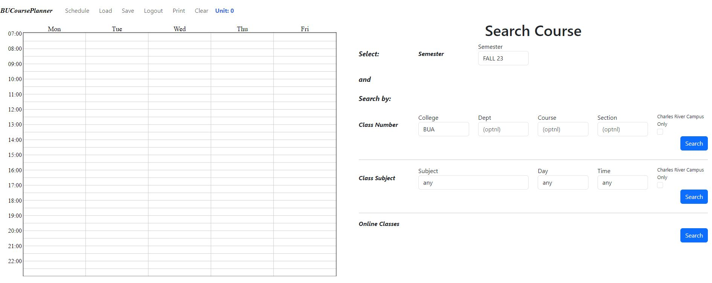
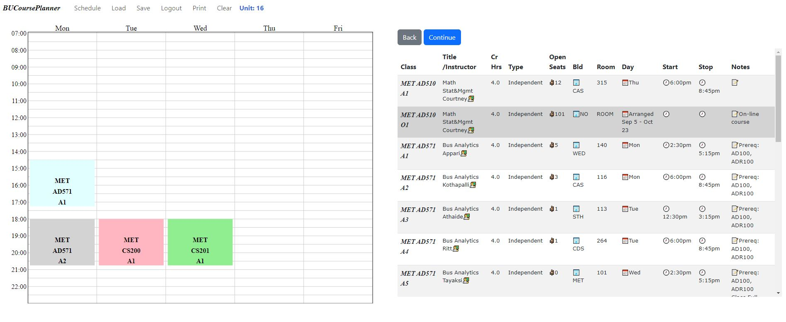

# BU Course Planner
Welcome to the BU Course Planner Web application! This application is designed to make course planning easier for Boston University students.

## How to Use
1. *Register*
    - Click **Load**, then click **Register** and enter your desire username. Click **Generate**, then use Google Authenticator to scan the QR code, then input your **OTP** and click **Confirm**. 
2. *Login*
    - Click **Load**, then input your username and otp and click **Load**.
3. *Search course*
    - **Class Search by Number**: Enter the semester, college, department, course, section, and main campus indicators, then click **Search**.
    - **Class Search by Subject**: Choose your preferred semester, subject, day, time and main campus indicators, then click **Search**.
    - **Online Course Search**: Simply choose your semester and click **Search**.
4. *Add course to your schedule*
    - click on the course you want to add
5. *Display more course result*
    - click **Continue**
6. *View schedule list*
    - click **Schedule**
7. *Remove a course from your schedule*
    - click on the course you want to delete, then click **Delete**
8. *Go back to add course window*
    - click **Back**
9. *Empty your schedule*
    - click **Clear**
10. *Save your schedule*
    - click **Save**
11. *Logout*
    - click **Logout**
12. *Print your schedule*
    - click **Print**

## Installation
1. Clone this repository to your local machine.
2. Navigate to the project directory.
3. Install the required dependencies with `npm install`.
4. Start the application with `npm start`.

## Reminder
Run the `main.py` on courseplanner-backend to start the server

